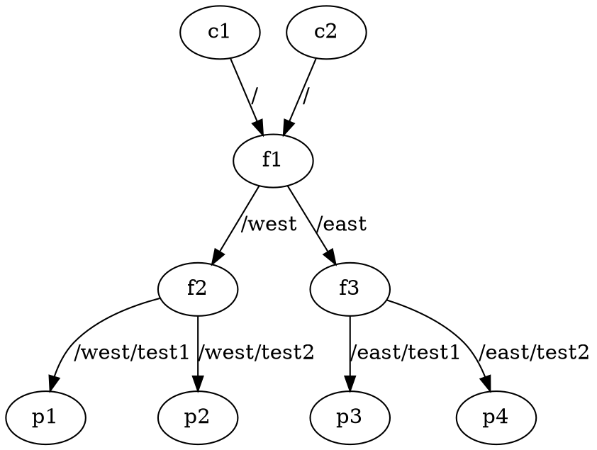

# NDN Traceroute

This project implements an **NDN Traceroute Client** and a **Simple Producer** based on the ICN Traceroute Protocol Specification as defined in [RFC 9507](https://www.rfc-editor.org/rfc/rfc9507.html).

**Note:** The Simple Producer is included for testing and development purposes only.

## Prerequisites

For building traceroute client:
- **Operating System**: macOS, Linux, or any UNIX-like system.
- **NDN Platform**:
  - [ndn-cxx library](https://github.com/named-data/ndn-cxx)
  - [NFD](https://github.com/named-data/NFD) (todo: this needs to be updated to use custom forwarder)
- **C++ Compiler**: Support for C++17 (e.g., GCC 7+, Clang 6+).
- **CMake**: Version 3.12 or higher.

For automated testing pipeline:
- **Containerization Service**: Docker CLI
- Python 3.12
  - pydot 3.0.2
  - pyparsing 3.2.0

## Building the Project

### 1. Clone the Repository

```bash
git clone https://github.com/saifulislampi/ndn-traceroute.git
cd ndn-traceroute
```

### 2. Install NDN Dependencies

Ensure that `ndn-cxx` and `NFD` are installed on your system. Follow the installation instructions provided in the official documentation.

### 3. Build the Applications

Create a build directory and compile the project using CMake:

```bash
mkdir build
cd build
cmake ..
make -j$(nproc)  # For Linux
# or
make -j$(sysctl -n hw.logicalcpu)  # For macOS
```

This will build both the Traceroute Client and the Simple Producer executables.

## Running the Applications

### Starting NFD

Before running the applications, ensure that the NDN Forwarding Daemon (NFD) is running:

```bash
nfd-start
```

Verify that NFD is running:

```bash
nfd-status
```

### Running the Simple Producer

In one terminal, start the Simple Producer:

```bash
cd build/producer
./simple-producer prod /example/test/traceroute
```

You should see output indicating that the producer is listening for Interests:

```plaintext
SimpleProducer: Listening for Interests on /example/test/traceroute
```

### Running the Traceroute Client

In another terminal, run the Traceroute Client:

```bash
cd build/client
./traceroute-client /example/test 5
```

Replace `/example/test` with the target name you wish to trace, and `5` with the maximum HopLimit (optional, defaults to 30).

**Sample Output:**

```plaintext
Sent Interest with HopLimit: 1
Hop 1, RTT: 5 ms, Forwarder: /example/producer, Reply Code: 4
Sent Interest with HopLimit: 2
Hop 2, RTT: 6 ms, Forwarder: /example/producer, Reply Code: 4
...
```

## Automated Testing Pipeline with Docker
This project also provides a configurable container-based network simulator for testing the traceroute client.

### Network Topology Specification DOT Files
Network topologies for the automated testing pipeline are specified in special DOT files.

Requirements:
- DOT file must contain exactly one `digraph`
- All networks nodes must be declared with a `class` attribute of either `"producer"`, `"client"`, or `"forwarder"`
- Nodes of class `"producer"` must also be declared with a `data` attribute whose value is a string containing the name of the data to produce
- Routes must be given a `label` attribute whose value is a string containing the route's name prefix

Below is an example of a valid network configuration DOT file.



### Generating the build directory from a DOT file
First, build the base `ndn-traceroute` Docker image from the NFD `build` image.

```bash
docker build -f NFD/Dockerfile -t nfd-build --target build NFD/
docker build -t ndn-traceroute .
```

To generate the build directory, run the `build-net.py` utility.
```
$ python3 build-net.py --help

usage: build-net.py [-h] [--config-template CONFIG_TEMPLATE] GRAPH

A program to build a docker compose file for an NDN network given a .dot file
specifying the network

positional arguments:
  GRAPH                 DOT file specifying the network

options:
  -h, --help            show this help message and exit
  --config-template CONFIG_TEMPLATE
                        Path to special NFD configuration template file.
                        Default: utils/nfd.conf.template
```

### Running the test network
The test network can be launched with the following commands:
```bash
cd build
docker compose up -d
# wait >5 seconds for containers to finish startup
docker exec <client node name> /client/build/traceroute-client ...
```
